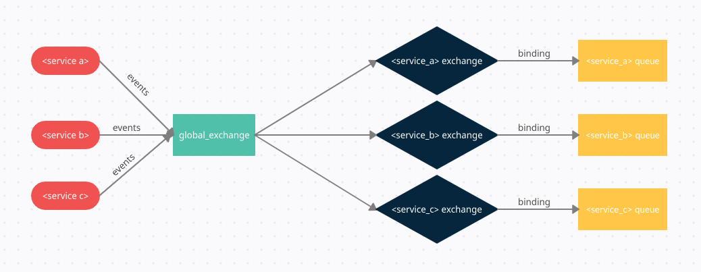

# Событийный механизм на основе RabbitMQ
Когда возникает событие о котором необходимо уведомить другие сервисы, событие необходимо передать через "шину событий", шина основана на RabbitMQ.

### Схема взаимодействия:
При возникновении события сервис отправляет его в общий exchange (обменник) который доступен ему только на запись, 
далее событие с помощью bindings (роутеров) расходится на все exchange (обменники) сервисов которые доступны сервису для чтения и конфигурации, 
в зависимости от установленных bindings (роутеров) событие отправляется в требуемую queue (очередь) или exchange (обменник) для дальнейшей обработки.


## Форматы именования
events_bus - общий exchange, доступен сервису только на запись.

<service_name> - exchange для сервиса, доступен сервису на чтение, конфигурирование, чистку.

<service_name> - очередь для сервиса.

<service_name>.<event.name> - имя события.

[Для создания exchange в rabbit треюуется в начале создать exchange с типом fanout (с тестовым сообщением) после чего переделать его в тип direct.](https://www.rabbitmq.com/blog/2010/10/19/exchange-to-exchange-bindings/) 
 
### Формат сообщений
Сообщения передаются в формате json (по умолчанию)
Поля объектов должны именоваться с использованием camelCase и находится в свойстве payload объекта события.
В объекте события так-же должно присутствовать свойство date, в котором находится дата и время события в формате YYYY-MM-DDThh:mm:ssTZD

```json
{
    "date": "1997-07-16T19:20:30+01:00",
    "payload": {
	    "id": 10,
	    "isActive": true,
	    "shortName": "KARL"
    }
}
```

## example using
```php
$config = require('config/event_bus.php');
$serviceName = $config['service_name'];

$connection = new IliaKologrivov\RabbitMQGlobalEventBus\EventsBusConnector($config['connection']['hosts'], $config['connection']['options'], $config['connection']['connection']);

//Example push event
class TestMiddlewareExample implements \IliaKologrivov\RabbitMQGlobalEventBus\Sender\EventMiddlewareContract
{
    public function handler(string $eventName, $payload): array
    {
        $payload['content'] = strtoupper($payload['content'] ?? '');

        return $payload;
    }
}

$testMiddleware = new TestMiddlewareExample();

$eventHandler = new \IliaKologrivov\RabbitMQGlobalEventBus\Sender\EventHandler();
$eventHandler->addMiddleware($testMiddleware);

$eventFormatter = new \IliaKologrivov\RabbitMQGlobalEventBus\Formatters\JsonEventFormatter();

$pusher = new \IliaKologrivov\RabbitMQGlobalEventBus\Sender\Sender(
    $connection, 
    $eventHandler,
    $eventFormatter,
    [
        'service_name' => $serviceName,
        //'general_exchange' => 'events_bus_exchange',
    ]
);

class TestEventExample extends \IliaKologrivov\RabbitMQGlobalEventBus\Sender\AbstractEvent
{
    public $content;

    public function getName():string
    {
        return 'test.event';
    }

    public function __construct(string $content)
    {
        $this->content = $content;
    }    
}

$testEvent = new TestEventExample('test_content');

$pusher->send($testEvent);

//example subscribe/unsubscribe
$subscriber = new \IliaKologrivov\RabbitMQGlobalEventBus\Subscriber\Subscriber($connection, [
    'service_name' => $serviceName,
    //'exchange_name' => $serviceName . '_v2_exchange',
    //'queue_name' => $serviceName . '_v2_queue',
]);
$fullEventNameForSubscribe = 'test_service_name.tests.event';
$subscriber->subscribe($fullEventNameForSubscribe);
$subscriber->unsubscribe($fullEventNameForSubscribe);

//example listener events
class EventDispatcherExample implements \IliaKologrivov\RabbitMQGlobalEventBus\Worker\EventDispatcherContract
{
    public function dispatch(object $event){
        // dispatch event
    }
}
$eventDispatcher = new EventDispatcherExample();

class HandlerExceptionExample implements \IliaKologrivov\RabbitMQGlobalEventBus\Worker\HandlerExceptionContract
{
    public function handle(Throwable $exception){
        //domain logic
    }
}
$handlerException = new HandlerExceptionExample();

$eventsMap = new \IliaKologrivov\RabbitMQGlobalEventBus\Worker\EventsMap([
    //'test_service_name.tests.event' => TestEvent::class,
]);

$worker = new \IliaKologrivov\RabbitMQGlobalEventBus\Worker\Worker(
    $connection,
    $eventDispatcher,
    $handlerException,
    $eventFormatter,
    $eventsMap,
    $subscriber,
    $serviceName
);

$worker->daemon();
```
